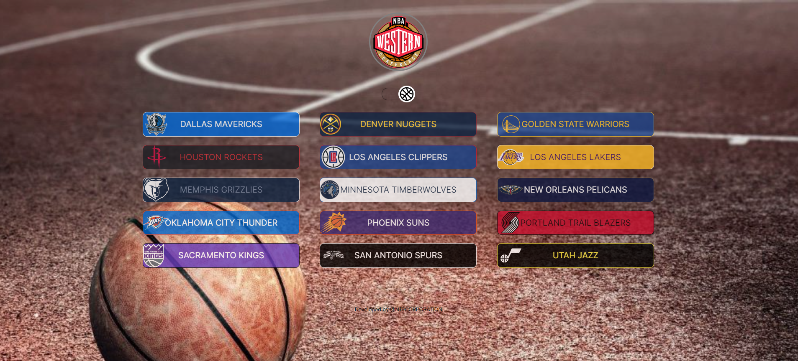

<h1 align="center">Conferências NBA</h1>

Website informativo dos times das conferências Leste e Oeste da NBA

 

Tecnologias utilizadas:
- HTML e CSS
- Git e Github
- Figma

O objetivo do projeto é facilitar o acesso direto ás páginas de cada time da NBA, sendo divididos assim como a própria liga os faz: Conferências LESTE e OESTE.